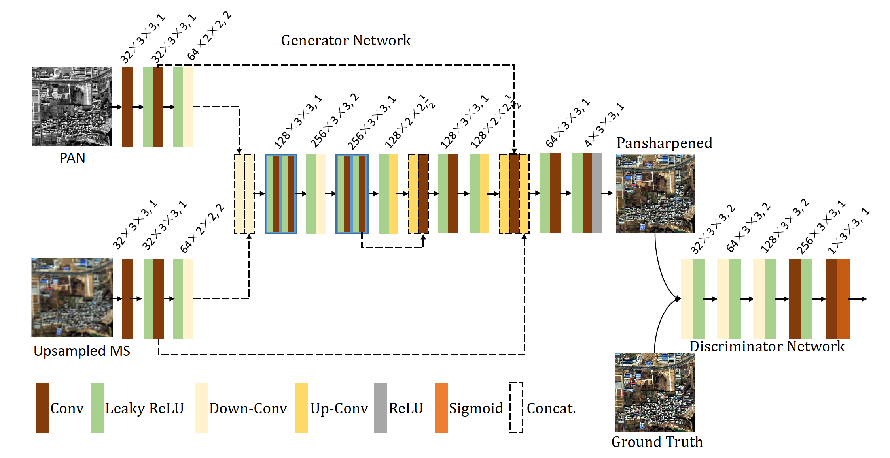

# How to Use this Project

This repo is the official implementation for [PSGAN: A Generative Adversarial Network for Remote Sensing Image Pan-sharpening](https://ieeexplore.ieee.org/document/9306912). 
The paper is accepted to TGRS2020.

1. build your own dataset
2. train and test the models 
3. evaluate the results

# Build Your Own Dataset

This project is based on Tensorflow, so the dataset will finally be made into '.tfrecords' format. The related codes are all in 'data' folder. 

Before running the codes, you must fix the path in codes according to your images. You can refer to our structure of the dataset. You can see detail in 'data' folder.

The order to run the codes:
```
cd PROJECT_PATH
cd data
python handle_raw.py
python gen_dataset.py
python gen_tfrecord.py
```
# Train and Test the Models 

You can just modify the args in run.py and run
```
cd PROJECT_PATH
python run.py
```

Generally the logs will be generated below the specific model folder.

Or you can directly run the specific model code for a more detail using. You can see the help of the args in each model codes. For example
```
cd PROJECT_PATH
cd model/psgan
nohup python -u psgan.py --mode train --train_tfrecord ** --test_tfreord ** ... > **.log 2>&1 &
```

# Evaluation the Results

You can just modify the args in eval.py and run
```
cd PROJECT_PATH
python eval.py
```

Generally the logs will be generated below the specific model folder.

Or you can directly run 'eval/eval_one.py' for a more detail using. For example
```
cd PROJECT_PATH
cd eval; nohup python -u eval_one.py --input_dir ** --num ** --blk ** --row ** --col ** --ref ** > **.log 2>&1 & 
```

# Model List

This project implement various sate-of-art Pan-Sharpening models in Tensorflow. The related codes are below 'model' folder, and each model one folder.

## Main Architecture


## psgan
psgan: psgan origin   

fu-psgan: upsample the MS images using strided convolution 

st-psgan: concatenate the PAN and MS input without two-stream architecture

# Dataset List

We create many datasets for the experiment.

QB_32: data from quickbird satellite, MS images cut into (32, 32, 4), PAN images cut into (128, 128)

QB_64: data from quickbird satellite, MS images cut into (64, 64, 4), PAN images cut into (256, 256)

GF-2_32: data from GaoFen-2 satellite, MS images cut into (32, 32, 4), PAN images cut into (128, 128)

GF-2_64: data from GaoFen-2 satellite, MS images cut into (64, 64, 4), PAN images cut into (256, 256)

GF-1_64: data from GaoFen-1 satellite, MS images cut into (64, 64, 4), PAN images cut into (256, 256)

WV-2_64: data from WorldView-2 satellite, MS images cut into (64, 64, 4), PAN images cut into (256, 256)

# Raw Images 

(Baidu Drive)link：https://pan.baidu.com/s/1FfDSsxlBMUPsJXjbxKEIhQ 
code：kpqa 

(Google Drive)link: https://drive.google.com/file/d/16owGAILT0uH8U5oMJrh2fwYGWUXhDpDc/view?usp=sharing

# Reference Environment
```
Ubuntu 16.04.6 LTS (GNU/Linux 4.4.0-142-generic x86_64)
Python 3.6.11
```
main python packages:
```
# Name          Version
gdal            3.1.2
matplotlib      3.3.2
numpy           1.19.1
scikit-image    0.17.2
scipy           1.5.2
tensorflow-gpu  1.3.0
```

# Citing PSGAN
Consider cite PSGAN in your publications if it helps your research.

```
@ARTICLE{9306912,
  author={Liu, Qingjie and Zhou, Huanyu and Xu, Qizhi and Liu, Xiangyu and Wang, Yunhong},
  journal={IEEE Transactions on Geoscience and Remote Sensing}, 
  title={PSGAN: A Generative Adversarial Network for Remote Sensing Image Pan-Sharpening}, 
  year={2021},
  volume={59},
  number={12},
  pages={10227-10242},
  doi={10.1109/TGRS.2020.3042974}}
}